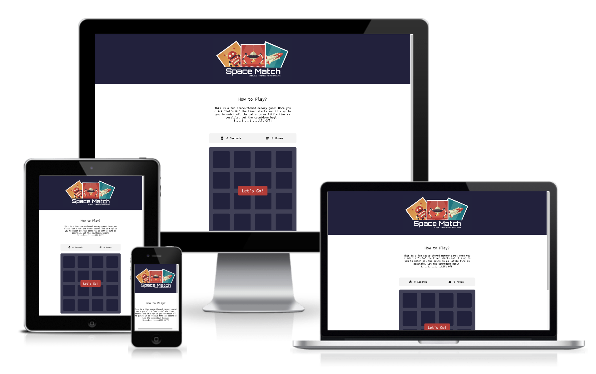
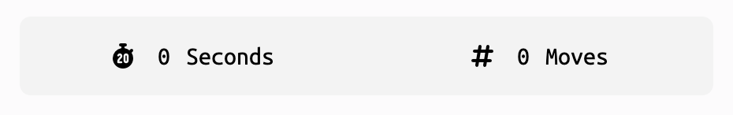
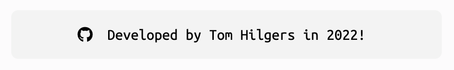
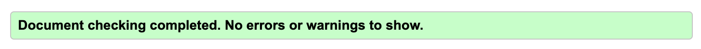

# **Space Match - A Memory Game**
## **Description**
This is a small web-based application which centres around a well-known game where a number of cards are presented face-down and the player, turning over only two cards at a time, must find matching pairs. The game is over once all card pairs have been matched. The theme of this game revolves around things space-related which makes it attractive to many interest groups, particularly to kids.

The application has been optimised to work on any kind of device, be that a mobile phone, tablet, laptop or desktop.

The live page can be found here: [Space Match - A Memory Game](https://tomh-22.github.io/Milestone-Project-1/)

 

 

# **Development**
The web-based application was developed using HTML,CCS and Javascript as the primary languages and an emphasis was placed on good UX design and best practice.

## **Users and Target Audience**

### **Target Audience**
The target audience is made up of a variety of different people, ranging form children and young adults, to adults and elderly people. While the design is primarily aimed at children, the game may be useful to all users in terms of being a good mind-excercise tool, strengthening a user's memory and other mental faculties. The game has a competitive edge too: as the time as well as the moves are displayed, users may challenge one another to complete the game in the shortest time and fewest moves possible. 

### **User Stories**
- A **New User** wants to be able to be able to understand the game's function and rules right away, as well as being able to operate the game's controls intuitively. 

- An **Existing User** might want to be able to play the game on a different device than the last time, and expects the game to work equally well on all devices. The may want to visit the developer's GitHub profile to find out more about how the game works from a programming perspective. 

- An **Admin User** might want to update the game by changing the images on the cards: this can easily be achieved even by someone who might not be very familiar with coding due to clean and readable code and appropriate commentary. 

## **Features**

### **Logo**
The main logo was created using Procreate: I utilised some of the existing images which I sourced for the game's cards, as well as the name of the game stylised with the `Orbitron` font, all on a dark blue background (`#262546`) which I also used for the `header` bar and as the back-face of the `card` elements.

### **Navigation**
Navigation is pretty limited as it is not really required for anything but starting and reloading the game. The player is able to start the game using a well-defined start button, then click on the cards to flip them and finally reload the game by pressing a button that is offered once the game is over. 

### **Timer & Moves**
A small section at the top of the game area dynamically displays the time elapsed since the game was started and the moves that the player has made in the game. 

### **Game Area**
The game area consists of a board and 16 cards: these cards are rendered face-down and include 8 sets of space-themed images on the face-down side. 

### **Footer**
A footer displays the developer's name and other details, as well as link to a GitHub profile using a GitHub Favicon icon.

### Multi-Device Capability**
The application was designed using a mobile-first approach: this allowed for easy addition of media queries to handle smaller screen sizes and while being able to maintain the one feel and design across all platforms.

## **Testing, Validation and Compatibility**

### **HTML Validation**
The HTML code was assessed using the W3C Mark-Up Validator Tool. While I did encounter some syntax errors, all were fixed prior to deployment. 

### **CSS Validation**
The HTML code was assessed using the W3C CSS Validator Tool. Again, while I did encounter some syntax errors, all were fixed prior to deployment. 

### **Lighthouse Testing**
Assessing the site based on performance, accessibility, best practices and SEO using Chrome Developer Tools' Lighthouse test highlighted some minor issues relating to the area of best practices: it noted that an image was forced to render in a way that did not maintain the image's original aspect ratio. The image in question is that which makes up the back of the `card` elements: this does not, however, affect the user experience whatsoever, as the image is of a monotone color only and changes of dimension or aspect ratio, in this case, has no effect on the image resolution or such. 

### **Cross-browser Checks and Device Testing**
I tested the site on a variety of browsers: Edge, Opera, Safari, Firefox and Chrome. Firefox handled the overlays a little differently, particularly those elements created thorugh Javascript. Adding a `z-index` attribute to those elements which reflected the desired order on the page sorted the problem. All others rendered the site as expected. I also tested the site on Chrome and Safari within iOS - this presented no problems. 

I added a media query feature which alters the layout of the page once the `vw` becomes less than `450px` to a format more suitable for mobile devices and smaller screens. These design changes work well up to a `vw` of `315px` at which point the layout becomes constrained. I could have added more styles as part of a further media query but decided against it as even a small mobile device offers a screen width of at least 320px nowadays. 

### **Links**

All links were checked and worked as expected. All external links opened in a new tab. 

## **Technologies and Resources Used**

- **Fontawesome** I used this to display icons on the site.

- **Google Fonts** I used Google Fonts to source and load the fonts used within the page. 

- **Am I Responsive** I used this site to test how the page would render on devices with different screen sizes. I also used it to generate a nice image for the Read Me file.

- **W3C Validation Tools** I used the Mark Up- and CSS Validation tools to test the site's code prior to deployment. 

- **W3 Schools** This website was very useful to me in terms of explaining HTML and CSS related concepts and best practice implementation. 

- **Stack Overflow** This provided a great resource in terms of troubleshooting code and learning to code more effectively.

- **Chrome Developer Tools** This was an invaluable tool during the development process in many ways, from 'Inspecting' elements and associated attributes to pre-deployment testing using the Lighthouse feature. 

- **Procreate** An iPad app I used to create the site's logo.

- **Adobe Srock** A subscription-based site providing stock illustrations, which I used within the application.

- **Convertio** I used this to convert images to a suitable format, `.webp` in this case. 

## **Known Bugs and Issues**

- **Clicking First Card** On occasion, when testing the application, I noted that the first card that gets flipped in the game, appears disabled and does not flip when clicked on again straight away as part of the second set of moves. This only occurs occasionally and has been difficult to reproduce but this is something I wish to get to the bottom of.  

- **Page Performance and Images** Performance is a little on the slow side but this may be intrinsically linked to being an image-heavy visual application. I am sure further optimisation could be implemented but I currently lack the skills to do so.

## **Deployment** 

The web application was deployed via GitHub Pages, as per the following steps:
- Within the Github repository, navigate to the "Settings" tab. 
- Then click on "Pages" with the menu on the left side. 
- Select the "main" or "master" branch as the source and select "Root" to the right of it. Then click on the save button.
- The link for the page will appear on the page shortly. 

## **Attributions**

- All of the images used in this project came from Adobe Stock. The set is titled "Space - set of flat design infographics elements" and is by Boyko.Pictures. I purchased a standard licence for same on [Adobe Stock](https://stock.adobe.com/).

- The Javascript code used to make the application work is based on a tutorial by Marina Ferreira: I utilised some of this code but adjusted and built on it significantly to incorporate a timer, a move counter and the ability create and remove DOM elements based on user actions. The tutorial and associated code can be found on [Github](https://marina-ferreira.github.io/projects/js/memory-game/).

